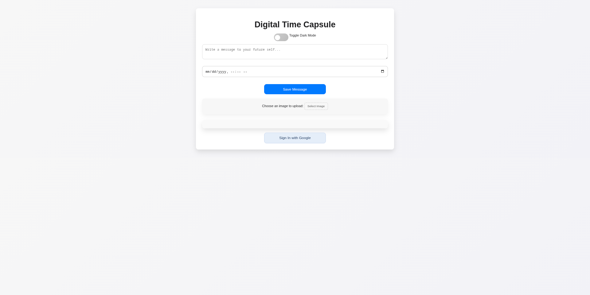
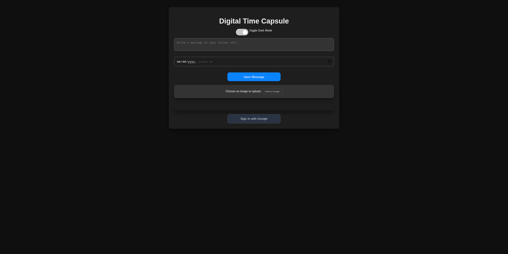

# Digital Time Capsule – **For the Future You (Or the Future of Your Friends)** 🕰️✨

### **Overview** 🚀

Imagine writing a message today, sending it to the *future*, and getting that message at the most inconvenient (or convenient) time in the next century. It's like time travel, but without the risk of getting stuck in the past, messing up the timeline, and accidentally becoming your own grandfather. 😜

With the **Digital Time Capsule**, you can:

* Send messages to your *future self* (because who wouldn't want to hear from their past self?)
* Share life advice with your friends... in the most cryptic, time-looping way possible.
* Upload images and videos of your cat for posterity. 🐱🎥
* Put your thoughts into the future... even though we know it’s just going to be some embarrassing “why did I send that?” text.

### **How It Works** 💻

1. **You Write Your Message**: Type your deeply thoughtful, or completely random, message to your future self. Maybe you’ll ask yourself, “What was I thinking?” or “How do I still not know how to cook pasta?”

2. **Set Your Unlock Time**: Pick when you want the message to appear. It could be a year, a decade, or 2045 (because let’s be real, no one’s going to remember to open it until then).

3. **Add Media**: Include photos or videos. Maybe a dance challenge? A prophecy about the future? A clip of your dog stealing your lunch? You decide.

4. **Sign in with Google** (or don’t, we’re not judging). You get a choice of signing in (like a responsible adult) or just winging it like a time-traveling rebel. ⏳

5. **Activate Dark Mode** (for maximum future vibes). Dark mode is for people who want to look like they’re working late or living in a dystopian future. It's basically a time capsule for your eyes.

---

### **Technologies Used** 🔧

* **LocalStorage**: Save your settings and preferences like *“I swear I’ll get my act together by next year.”*
* **SessionStorage**: Temporarily hold your message (before you delete it because you hate it 10 minutes later).
* **IndexedDB**: For storing all those essential future things – like embarrassing photos and weirdly cryptic notes to yourself.
* **Cookies**: They track your login status, not your snack preferences (unfortunately).
* **Service Workers**: They allow your time capsule to work offline (which is helpful when you’re in the past, or on a Wi-Fi-less vacation).
* **WebSockets**: Real-time updates for those brave enough to send messages in public time capsules. Because nothing says “living on the edge” like sharing your thoughts with the entire world. 🌍

---

### **Key Features** 🎉

1. **Future Self?** You can send a message to *you*. Or, if you're feeling generous, send it to a friend (but who wants to be that nice?)

2. **Set a Time to Unlock**: You can pick any date. Imagine receiving a message on your birthday... or when you're deep in your "what is life?" phase.

3. **Upload Images & Videos**: Maybe you want to send a reminder about that “one time” in college. The one you *definitely* don’t want to forget. But trust us, you’ll want to.

4. **Google Sign-In**: Because why not sign in with Google and pretend you’re a responsible human being, right? ☑️

5. **Dark Mode**: For those days when you feel like you’re in a secret agent movie, but really you’re just writing a note to yourself about how to finally fold a fitted sheet.

---

### Screenshot

### **Demo Video** 🎥

[Watch the demo video here](https://youtu.be/JxN5uzTxgsI)

### **Getting Started** 🚀

1. Clone this repo and try not to mess anything up. (Kidding, you won’t, probably).
2. Open your browser and let the time-traveling magic begin.
3. If things go wrong, blame it on "time dilation." That's science, right?

---

### **Roadmap** 🛤️

* **Phase 1**: Make it work (done!).
* **Phase 2**: Send a message back to your past self and confuse your past brain.
* **Phase 3**: Add a "message to your future dog" feature. 🐶
* **Phase 4**: Build a time machine (this is a *very* ambitious phase).

---

### **Final Thoughts** 🧠

This app is *whimsical*, *useful*, and totally not a waste of time (okay, maybe just a little). It’s a fun experiment in sending future-you some peace of mind... or pure confusion.

So go ahead, write your future self a note. It’s like sending a postcard to tomorrow – except with more nostalgia and less actual travel. Enjoy!

---

## License

This project is licensed under the MIT License - see the [LICENSE](./LICENSE) file for details.

# Happy Time Traveling! ⏳🎉
